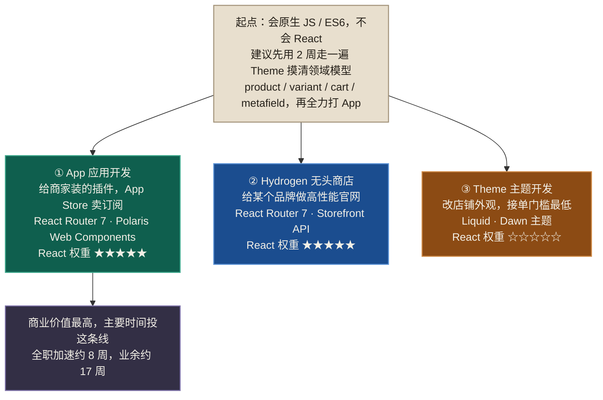

# Shopify 0→1 前端知识补全计划

> 面向人群：**会原生 JS / ES6，不会 React**，准备从零做 Shopify 开发。
> 覆盖方向：**App 应用开发 + Hydrogen 无头商店 + Theme 主题开发** 三线全景。
> 技术栈事实核对日期：**2026-07-27**（数据来自 Shopify 官方仓库源码，非二手教程）。



> 全套文档里，**松绿 = App 线、水蓝 = Hydrogen 线、赭石 = Theme 线**，颜色一致，不再重复标注图例。

---

## 0. 先看这三条结论

在翻任何教程之前，先记住这三条，否则你会浪费大量时间学过时的东西。

### 结论一：Polaris React 已经死了

`@shopify/polaris` 这个 React 组件库，Shopify 官方仓库 README 第一行写着：

> **# Polaris React (⚠️ Deprecated)**
> The Shopify Polaris React library is deprecated. We are no longer accepting contributions or feature requests in this repository.
> On October 1, 2025, we released our Polaris Web Components for Shopify app development.

取而代之的是 **Polaris Web Components**——原生自定义元素，写出来长这样：

```jsx
<s-page heading="Shopify app template">
  <s-button slot="primary-action" onClick={generateProduct}>Generate a product</s-button>
  <s-section heading="Get started">
    <s-paragraph>Hello</s-paragraph>
  </s-section>
</s-page>
```

**影响**：网上绝大多数 Shopify App 教程（含各类视频课、掘金/知乎文章）教的还是 `import { Page, Button, Card } from '@shopify/polaris'`。你照着学，写出来的是遗留代码。
**衍生影响**：你需要额外补一块大多数 React 教程不讲的知识——**Web Components 与 React 的互操作**。这在本文档 [03 号文件](docs/03-其他前端知识清单.md) 里有专章。

### 结论二：官方模板已从 Remix 迁到 React Router 7

| | 现役模板 | 遗留模板 |
|---|---|---|
| 仓库 | `Shopify/shopify-app-template-react-router` | `Shopify/shopify-app-template-remix` |
| 框架 | `react-router@^7.12` | `@remix-run/*@^2.16` |
| Shopify 适配包 | `@shopify/shopify-app-react-router@^1.1.0` | `@shopify/shopify-app-remix@^4.1.0` |
| UI | Polaris Web Components（仅 `@shopify/polaris-types`） | `@shopify/polaris@^12` React 组件 |

Hydrogen 也一样：skeleton 模板用 `react-router@7.16.0`。

**影响**：**React Router 7 是三线里唯二的共同框架**（App 线和 Hydrogen 线都用它）。学它的性价比极高。但注意——RR7 不是你以为的那个"路由库"，它现在是个带 SSR、loader/action 数据层的全栈框架（Remix 并入的结果）。

### 结论三：你需要的 React 比你以为的少，但需要的"非 React"比你以为的多

Shopify 全栈模板里，传统 React 教程的重头戏几乎用不上：

| 传统 React 教程重点 | 在 Shopify 里的实际地位 |
|---|---|
| `useEffect` + `fetch` 拉数据 | ❌ 基本不用。数据在服务端 `loader` 里取 |
| 受控表单 + `onSubmit` | ❌ 基本不用。用 `<Form>` / `useFetcher` |
| Redux / Zustand 全局状态 | ❌ 用不上。状态在 URL 和 loader 里 |
| React 组件库 | ❌ UI 是 Web Components |
| JSX / props / state / 组合 | ✅ 天天用 |
| Hooks 心智模型 | ✅ 必须懂 |

而真正卡住新人的，是这些**不属于 React 的东西**：GraphQL 的 Relay 分页游标、OAuth + session token、iframe 嵌入与 CSP、TypeScript 泛型、Liquid 模板。

---

## 1. 文档索引

按顺序读即可。标 ⭐ 的是核心。

| # | 文档 | 内容 | 适合什么时候读 |
|---|---|---|---|
| 01 | [技术栈现状与选型](docs/01-技术栈现状与选型.md) | 三条线到底是什么、怎么选、真实依赖清单 | 现在，10 分钟 |
| 02 ⭐ | [React 知识补充清单](docs/02-React知识补充清单.md) | 需要补哪些 React 知识，分 A/B/C 级，每项说明"Shopify 哪里用到" | 现在，精读 |
| 03 ⭐ | [其他前端知识清单](docs/03-其他前端知识清单.md) | TS / GraphQL / Web Components / 网络 / CSS / Liquid 等 13 块 | 现在，精读 |
| 04 ⭐ | [学习路线图](docs/04-学习路线图.md) | 分 7 个阶段，每阶段有产出物和自测标准 | 看完 02、03 后 |
| 05 ⭐ | [React 速成教程（从 JS 到 React）](docs/05-React速成教程.md) | 真正的手把手教程，含大量 JS↔React 对照代码 | 阶段 1 |
| 06 | [TypeScript 与 GraphQL 教程](docs/06-TypeScript与GraphQL教程.md) | 够用就好的 TS + Shopify GraphQL 实战 | 阶段 2 |
| 07 | [React Router 7 数据流教程](docs/07-ReactRouter7数据流教程.md) | loader / action / fetcher，Shopify 全栈的心脏 | 阶段 3 |
| 08 | [三条线实战入门](docs/08-三条线实战入门.md) | App / Hydrogen / Theme 各自的第一个项目 | 阶段 4-6 |
| 09 | [避坑清单与资源汇总](docs/09-避坑清单与资源.md) | 高频坑 + 官方文档地图 + 推荐资源 | 随时查 |

---

## 2. 三十秒选型

如果你还没想好先做哪条线：

```
你想赚钱／做产品卖给商家          → App 应用开发   （React 权重 ★★★★★）
你想给自己或客户做一个高性能店面   → Hydrogen      （React 权重 ★★★★★）
你想接外包／改店铺外观／门槛最低   → Theme 主题     （React 权重 ☆☆☆☆☆）
```

**给你的建议**（基于"会 JS 不会 React"这个起点）：

> **先 Theme 摸清 Shopify 的业务模型（2 周），再全力打 App 线。**

理由：
1. Theme 线不需要 React，能让你**最快建立对 Shopify 领域模型的直觉**（product / variant / collection / cart / checkout / metafield）。这套模型在 App 和 Hydrogen 线里是完全复用的，而且是新人最容易懵的部分。
2. Theme 线能让你立刻看到界面变化，正反馈快，不会在环境配置里耗死。
3. 补完领域模型再学 React，你在阶段 4 学 App 时只需要对付"新语言"，不用同时对付"新业务"。**一次只翻一座山。**
4. App 线是三条里商业价值最高、React 含量最高的，值得把主要时间投进去。

如果你时间极紧、只想要一条线：**直接走 App 线**，跳过 Theme，按 [04 学习路线图](docs/04-学习路线图.md) 的"加速版"走。

---

## 3. 环境要求（三线通用）

核实自官方模板的 `engines` 字段：

| 项 | App 线（React Router 模板） | Hydrogen 线 |
|---|---|---|
| Node | `>=20.19 <22 \|\| >=22.12` | `^22 \|\| ^24` |
| 包管理 | npm / pnpm / yarn 均可 | pnpm（官方仓库用 pnpm@10.16.1） |
| TypeScript | ^5.9 | ^5.9 |
| Vite | ^7.3 | ^8.0 |
| React | ^18.3.1 | ^18.3.1 |

**取交集，装 Node 22.12+ 最省事**，两条线都能跑。

```bash
# 推荐用 fnm 或 nvm 管理 Node 版本
brew install fnm
fnm install 22
fnm use 22
node -v   # 应输出 v22.x

# Shopify CLI（三条线共用同一个 CLI）
npm install -g @shopify/cli
shopify version
```

还需要一个 **Shopify Partner 账号**（免费）和一个 **development store**（免费、不限时、可测下单）：
https://partners.shopify.com

---

## 4. 怎么用这套文档

1. **不要通读完再动手。** 02、03 是清单性质，扫一遍知道有哪些东西即可，不要试图记住。
2. **以 04 路线图为主线**，每个阶段回头查 02/03 里对应的条目。
3. **每个阶段必须产出可运行的东西**，路线图里每阶段都标了"产出物"。看懂 ≠ 会写。
4. **遇到具体报错先查 09**，高频坑都在那。

---

## 5. 版本与时效性声明

- 本文档的依赖版本、包名、废弃状态，均于 **2026-07-27** 从以下来源实际抓取核实：
  - `github.com/Shopify/shopify-app-template-react-router`（package.json、app/shopify.server.ts、app/routes/*.tsx）
  - `github.com/Shopify/shopify-app-template-remix`（package.json）
  - `github.com/Shopify/hydrogen`（templates/skeleton/package.json、pnpm-workspace.yaml）
  - `github.com/Shopify/polaris`（README.md 废弃声明）
  - `github.com/Shopify/dawn`（目录结构）
- **Admin API 版本**：官方模板当前固定在 `ApiVersion.October25`（即 `2025-10`）。Shopify 按季度发版（`YYYY-01/04/07/10`），每个版本支持 12 个月。**具体最新稳定版请以官方 versioning 页面为准**，我没有在联网核实中拿到该页面的确切内容，不做断言。
- Shopify 生态迭代很快（Polaris 一年内整体换代就是例证）。**开工前务必用 `npm create @shopify/app@latest` 拉一次最新模板，以模板实际内容为准**，本文档用于建立地图，不用于替代官方文档。
