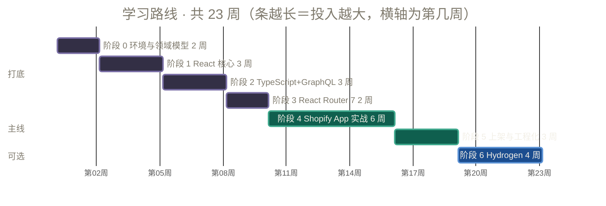
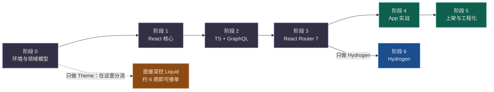

# 04 · 学习路线图

> 起点：会 JS，不会 React。终点：能独立做出并上架一个 Shopify App。
> **总时长：约 5-6 个月（每周 10-15 小时）** / 全职约 8-10 周。
> 每个阶段都有**硬性产出物**——看懂不算学会，跑起来才算。

---

## 路线总览



<details>
<summary>纯文本版（无 Mermaid 渲染环境展开）</summary>

```
阶段 0  环境与领域模型     2 周   ← 不碰 React，先摸清 Shopify 是什么
   ↓
阶段 1  React 核心         3 周   ← 纯 React，不碰 Shopify
   ↓
阶段 2  TypeScript+GraphQL 3 周   ← 两条腿一起补
   ↓
阶段 3  React Router 7     2 周   ← App 和 Hydrogen 的共同底座
   ↓
阶段 4  Shopify App 实战   6 周   ★ 主线，最大投入
   ↓
阶段 5  上架与工程化       3 周   ← 从"能跑"到"能卖"
   ↓
阶段 6  Hydrogen（可选）    4 周   ← 想接品牌站的项目再学
```

</details>

**分叉说明**：



阶段 0-3 是**三条线的公共前缀**（Theme 线除外，它在阶段 0 之后就分流）。所以：

- 只想做 **App** → 走 0→1→2→3→4→5，可跳过阶段 0 的 Theme 部分（但别跳领域模型）
- 只想做 **Theme** → 只需阶段 0，然后直接深挖 Liquid，约 6 周即可接单
- 只想做 **Hydrogen** → 走 0→1→2→3→6

---


# 阶段 0 · 环境与领域模型（2 周）

> **本阶段完全不碰 React。** 目的是先把"Shopify 是什么"搞明白，避免后面同时对付新语言和新业务。


## 0.1 环境搭建（第 1 天）

```bash
# Node
brew install fnm
fnm install 22 && fnm use 22 && node -v

# Shopify CLI
npm install -g @shopify/cli
shopify version

# 编辑器
# VS Code + 扩展：ESLint, Prettier, GraphQL, Shopify Liquid, Error Lens
```

注册（免费）：

1. Partner 账号：[https://partners.shopify.com](https://partners.shopify.com)
2. 在 Partner 后台创建一个 **development store**（选"用于测试和开发"）
3. 给 dev store 导入示例数据（后台有一键导入按钮）


## 0.2 摸清后台（第 2-3 天）

**别写代码，先当一次商家。** 在你的 dev store 里手动做完这些：

- [ ] 创建一个商品，加 3 个 variant（尺码 S/M/L），各设不同价格和库存
- [ ] 创建一个 manual collection 和一个 smart collection（自动规则）
- [ ] 给商品加一个 **metafield**（后台 → 设置 → 自定义数据）
- [ ] 从店面下一个测试订单，走完整个 checkout
- [ ] 在后台给订单发货、退款
- [ ] 装一个免费 App（比如 Shopify 官方的），观察它在后台长什么样

**这一步的价值被严重低估。** 做完之后你对 product/variant/collection/order/fulfillment 的关系会有直觉，后面看 GraphQL schema 时不会懵。

## 0.3 Liquid 与主题（第 2 周）

```bash
shopify theme init my-theme          # 会拉 Dawn
cd my-theme
shopify theme dev --store your-store.myshopify.com
```

任务清单：

- [ ] 读懂 `layout/theme.liquid` 的整体结构
- [ ] 找到商品页模板 `templates/product.json`，理解它是怎么引用 section 的
- [ ] 改一个 section 的 schema，加一个 setting，在主题编辑器里看到它出现
- [ ] 写一个自己的 section：展示某个 collection 的前 4 个商品
- [ ] 读一个 Dawn 的 `assets/*.js`，认出里面的 `customElements.define`
- [ ] 用 Ajax Cart API 写一个"加入购物车"按钮


### 阶段 0 产出物 ✅

> 一个基于 Dawn 修改的主题，包含**至少一个你自己写的 section**（带可配置 setting），并能通过 `shopify theme push` 推到 dev store 看到效果。


### 自测

- 能说清 Product 和 Variant 的区别，以及哪个才能加入购物车
- 能说出 section / block / setting / template JSON 的关系
- 能解释 metafield 是干什么的

---


# 阶段 1 · React 核心（3 周）

> **本阶段完全不碰 Shopify。** 在纯 React 环境里把 [02 号文档](02-React知识补充清单.md) 的 A 级 12 项吃透。
> 详细教学见 [05 · React 速成教程](05-React速成教程.md)。


## 环境（故意用最简单的）

```bash
npm create vite@latest react-practice -- --template react-ts
cd react-practice && npm install && npm run dev
```

用 TS 模板（`react-ts`），**从第一天就习惯 TS**，别先 JS 再迁移。

## 周计划

**第 1 周 — 心智模型 + 基础**

- A3 渲染心智模型（最先建立，反复读）
- A1 JSX / A2 组件与 Props / A6 条件渲染 / A7 列表与 key
- 练习：把一个静态 HTML 页面拆成 5 个以上 React 组件

**第 2 周 — 状态与交互**

- A4 useState + 不可变更新（重点，多写）
- A5 事件处理 / A9 受控组件 / A10 状态提升
- 练习：待办列表（增删改查 + 筛选 + 编辑）

**第 3 周 — Hooks 与结构**

- A8 useEffect（**重点是理解"何时不该用"**）
- A11 Context / A12 生命周期心智
- B1 useRef / B2 自定义 Hook / B7 React DevTools
- 练习：抽出 2 个自定义 Hook


## 建议练习项目（三选一，别都做）


| 项目                         | 练到什么                                | 难度  |
| -------------------------- | ----------------------------------- | --- |
| 待办清单（增删改查+筛选+localStorage） | useState、列表 key、受控组件、useEffect 正当用法 | ★★☆ |
| 商品筛选页（用假数据 JSON）           | 派生状态、多条件筛选、组件拆分                     | ★★★ |
| 简易看板（拖拽可跳过）                | 状态提升、Context                        | ★★★ |


**推荐第 2 个**——它最接近你之后要写的 Shopify 界面。

## ⚠️ 本阶段的三条纪律

1. **不许装 Redux / Zustand / React Query / Ant Design。** 你要练的是 React 本身。
2. **不许用 AI 直接生成整个组件。** 可以问概念，不要抄答案——手指的肌肉记忆是这个阶段的目的。
3. **每写一个** `useEffect`**，先问自己"能不能不用"。** 90% 的答案是能。


### 阶段 1 产出物 ✅

> 一个有 8 个以上组件、包含增删改查和筛选的 React 应用，**零全局状态库**，且能说清每个 `useEffect` 存在的理由。


### 自测

- 不查文档能写出 useState 的不可变更新（数组增/删/改）
- 能解释为什么不能用 index 当 key
- 能说出三个"不该用 useEffect"的场景
- 能用 React DevTools 找出一个组件为什么重渲染

---


# 阶段 2 · TypeScript + GraphQL（3 周）

> 两条腿一起补。这两块是后面所有内容的通用货币。


## TypeScript（1.5 周）

**方法：不要单独学。** 把阶段 1 的项目全部加上类型标注。

任务清单：

- [ ] 给所有组件的 props 定义 interface
- [ ] 给所有 state 加类型
- [ ] 把 `any` 全部消灭（`tsconfig` 打开 `strict`）
- [ ] 定义一个联合类型（如 `type Status = 'draft' | 'active'`）并用 switch 做穷尽检查
- [ ] 用一次泛型函数
- [ ] 理解 `typeof fn` 和 `ReturnType<typeof fn>`

**判定标准**：`tsc --noEmit` 零报错，且没有一个 `as any`。

## GraphQL（1.5 周）

**方法：全程在 Shopify GraphiQL 里练，不写代码。**

在 dev store 后台或通过 CLI 打开 GraphiQL 探索器，完成：

- [ ] 查询前 10 个商品的 id / title / status
- [ ] 用变量 `$first: Int!` 参数化上面的查询
- [ ] 查询商品的 variants，理解 `edges { node { } }` 嵌套
- [ ] 用 `pageInfo.endCursor` + `after` 参数翻到第二页
- [ ] 写一个 `productCreate` mutation，**并查询 userErrors**
- [ ] 故意传一个非法参数，观察 userErrors 的返回结构
- [ ] 观察响应里的 `extensions.cost`，理解限流机制
- [ ] 查询一个商品的 metafields
- [ ] 用 fragment 复用字段选择

详细内容见 [06 · TypeScript 与 GraphQL 教程](06-TypeScript与GraphQL教程.md)。

### 阶段 2 产出物 ✅

> ① 阶段 1 的项目全量 TS 化且 `tsc --noEmit` 通过。
> ② 一个 `.graphql` 文件，收录你亲手在 GraphiQL 里跑通的 10 个查询/变更，每个带注释说明用途。


### 自测

- 能读懂 `const data = useLoaderData<typeof loader>()` 这行在做什么
- 能不查文档写出一个带变量和 pageInfo 的分页查询
- 能说出 GraphQL 三层错误（传输/GraphQL/userErrors）的区别

---


# 阶段 3 · React Router 7 数据层（2 周）

> **投入产出比最高的两周。** App 和 Hydrogen 都建立在它之上。

用官方模板起一个空的 RR7 项目（不带 Shopify），或者直接用 Shopify App 模板但只关注框架部分。

任务清单：

- [ ] 理解文件路由约定：`_index`、`.`（嵌套）、`_`（无布局）、`$param`
- [ ] 写一个 `loader`，`useLoaderData()` 消费
- [ ] 写一个 `action`，用 `<Form method="post">` 提交
- [ ] 用 `useFetcher()` 做一次不导航的提交
- [ ] 用 `useNavigation()` 显示全局 loading
- [ ] 用 `useSearchParams()` 做一个筛选器，验证刷新后状态保留
- [ ] 写嵌套路由 + `<Outlet />`
- [ ] 写 `ErrorBoundary` 和 `headers` 导出
- [ ] 跑 `react-router typegen`，观察生成的类型

详细内容见 [07 · React Router 7 数据流教程](07-ReactRouter7数据流教程.md)。

### 阶段 3 产出物 ✅

> 一个 RR7 应用：列表页（loader 拉数据）+ 详情页（嵌套路由）+ 新建表单（action）+ URL 筛选 + 错误边界。**全程零** `useEffect` **拉数据。**


### 自测

- 能画出"浏览器请求 → loader → 渲染 → hydrate"的完整时序
- 能说出 `<Form>` 和 `useFetcher().submit()` 什么时候用哪个
- 能说出哪些状态该放 URL

---


# 阶段 4 · Shopify App 实战（6 周）★ 主线

> 前面所有铺垫都是为了这个阶段。


## 4.1 跑通模板（第 1 周）

```bash
npm create @shopify/app@latest
# 选 React Router 模板（不是 Remix）
cd your-app
npm run dev
```

任务清单：

- [ ] 把 App 装到 dev store，在后台看到它
- [ ] 点"Generate a product"按钮，在后台确认商品真的建出来了
- [ ] **逐行读懂** `app/shopify.server.ts`、`app/routes/app.tsx`、`app/routes/app._index.tsx`
- [ ] 找出模板里所有 `<s-*>` 元素，对照 Polaris Web Components 文档查它们的 API
- [ ] 改 `shopify.app.toml` 里的 scopes，观察重新授权流程
- [ ] 在 GraphiQL 里跑通一个查询，再搬到 loader 里

**⚠️ 本周最重要的事**：读懂模板。**不要急着写新功能。** 官方模板是最好的教材，它每一行都有理由。

## 4.2 Polaris Web Components（第 2 周）

- [ ] 通读 Polaris Web Components 文档，把常用组件过一遍
- [ ] 用 `<s-page>` `<s-section>` `<s-stack>` `<s-box>` 搭一个两栏布局
- [ ] 用 `slot="primary-action"` / `slot="aside"` 实现页面骨架
- [ ] 做一个表格展示商品列表
- [ ] 做一个表单（`<s-text-field>` 等）
- [ ] **踩一次 D1 的坑**：给某个组件传数组属性，观察它失败，再用 ref 修好
- [ ] **踩一次布尔坑**：写 `loading={false}`，观察问题，改成条件展开


## 4.3 核心功能开发（第 3-4 周）

选一个**真实、小而完整**的 App 想法。推荐这几个（复杂度合适）：


| 想法        | 涉及的 API                        | 难度  |
| --------- | ------------------------------ | --- |
| 批量给商品打标签  | products query + productUpdate | ★★☆ |
| 低库存预警看板   | inventoryLevels + 邮件/webhook   | ★★★ |
| 订单导出 CSV  | orders query + 分页 + 文件下载       | ★★★ |
| 商品自定义字段管理 | metafields / metaobjects       | ★★★ |


任务清单：

- [ ] 商品列表页（分页！必须用 cursor，不能一次拉完）
- [ ] 详情页 + 编辑（mutation + userErrors 处理）
- [ ] 用 Prisma 存一点自己的数据（比如用户配置）
- [ ] 处理一个 webhook（如 `products/update`），验签 + 幂等
- [ ] 限流处理：写一个带指数退避的重试
- [ ] 错误状态、空状态、加载状态都要有


## 4.4 扩展与集成（第 5-6 周）

- [ ] 加一个 **App Bridge 能力**：resource picker（让商家选商品）、toast、modal
- [ ] 尝试一个 **App Extension**（admin action / admin block / theme app extension）
- [ ] 配置 **GraphQL codegen**，让查询有完整类型
- [ ] 加 **i18n**（Shopify 要求 App 支持多语言）


### 阶段 4 产出物 ✅

> 一个功能完整的 Shopify App：至少 3 个页面、带分页的列表、可写入的 mutation、一个 webhook、自己的数据库表、完整的错误/空/加载状态处理。装在 dev store 上真实可用。


### 自测

- 能说清一次 App 请求从浏览器到 Shopify API 的完整链路（含鉴权）
- 能处理 GraphQL 的三层错误
- 能解释为什么 `authenticate.admin()` 只能在 loader/action 里调

---


# 阶段 5 · 上架与工程化（3 周）

> 从"能跑"到"能卖"。**这个阶段决定你的 App 能不能过审。**


## 5.1 生产化（第 1 周）

- [ ] 数据库从 SQLite 换成 Postgres
- [ ] 部署到真实主机（Fly.io / Railway / Render）
- [ ] 配置环境变量、HTTPS
- [ ] 日志与错误监控（Sentry 之类）
- [ ] 处理"多实例部署下 session 共享"


## 5.2 合规（第 2 周）— 审核硬性要求

- [ ] **GDPR webhook** 三件套：`customers/data_request`、`customers/redact`、`shop/redact`
- [ ] 卸载 webhook `app/uninstalled` → 清理数据
- [ ] 隐私政策页面
- [ ] Billing API（如果收费）
- [ ] 性能：Shopify 有 Web Vitals 要求
- [ ] 无障碍（a11y）基本达标


## 5.3 测试与上架（第 3 周）

- [ ] 写关键路径的测试（Vitest + Testing Library）
- [ ] App Store listing：截图、描述、定价
- [ ] 提交审核，处理反馈


### 阶段 5 产出物 ✅

> 一个部署在生产环境、通过 Shopify 自查清单、可提交审核的 App。

---


# 阶段 6 · Hydrogen（可选，4 周）

> 只在你要接品牌独立站项目时学。有了阶段 1-3 的底子，这里会顺很多。

```bash
npm create @shopify/hydrogen@latest
```


## 周计划

**第 1 周 — 跑通与结构**

- [ ] 起 skeleton 模板，连上 dev store
- [ ] 读懂路由结构和 `root.tsx`
- [ ] 理解 `storefront.query()` 和 codegen
- [ ] 做出商品列表页和详情页

**第 2 周 — 购物车与结账**

- [ ] Cart 的创建、增删改
- [ ] 跳转 Shopify Checkout
- [ ] 用 `useOptimisticCart` 做乐观更新

**第 3 周 — 性能与缓存**

- [ ] 缓存策略：`CacheShort` / `CacheLong` / 自定义
- [ ] `Suspense` + `<Await>` 延迟加载非关键数据
- [ ] 图片优化（`<Image>` 组件）
- [ ] **Workers 运行时限制实战**：故意装一个依赖 Node 内置模块的包，观察它怎么炸，学会排查

**第 4 周 — SEO 与上线**

- [ ] meta / structured data / sitemap
- [ ] 部署到 Oxygen：`shopify hydrogen deploy`
- [ ] Lighthouse 跑分优化


### 阶段 6 产出物 ✅

> 一个部署在 Oxygen 上、可以完成"浏览 → 加购 → 结账"完整链路的店面，Lighthouse 性能分 90+。

---


# 加速版（只做 App，全职 8 周）

如果你时间充裕且能全职投入：


| 周   | 内容                                           |
| --- | -------------------------------------------- |
| 1   | 环境 + 领域模型（跳过 Theme 实操，只逛后台） + React 基础 A1-A7 |
| 2   | React A8-A12 + B 级 + 一个练习项目                  |
| 3   | TypeScript 全量 + GraphQL 在 GraphiQL 里练透       |
| 4   | React Router 7 数据层                           |
| 5   | Shopify App 模板逐行读懂 + Polaris WC              |
| 6-7 | 核心功能开发                                       |
| 8   | 部署 + 合规 + 提审                                 |


**风险提示**：加速版跳过了阶段 0 的 Theme 实操，你对领域模型的直觉会弱一些，在阶段 6-7 会以"频繁查文档"的形式还回来。可以接受，但要有心理准备。

---


# 进度追踪表

复制这张表，每完成一项打勾。

```
阶段 0  环境与领域模型
  □ Node 22 + Shopify CLI 装好
  □ Partner 账号 + dev store 建好
  □ 手动完成建品/建集合/下单/发货全流程
  □ 写出一个自定义 section              ← 产出物

阶段 1  React 核心
  □ A3 渲染心智模型（能讲给别人听）
  □ A1/A2/A6/A7 JSX 组件 条件 列表
  □ A4/A5/A9/A10 状态 事件 表单 提升
  □ A8/A11/A12 effect context 生命周期
  □ B1/B2/B7 ref 自定义Hook DevTools
  □ 8 组件以上的练习项目                 ← 产出物

阶段 2  TS + GraphQL
  □ 项目全量 TS 化，tsc --noEmit 通过    ← 产出物
  □ GraphiQL 里跑通 10 个查询            ← 产出物
  □ 理解 edges/node/pageInfo
  □ 理解 userErrors 和限流

阶段 3  React Router 7
  □ loader / action / fetcher
  □ 嵌套路由 / URL 状态 / ErrorBoundary
  □ 完整 CRUD 应用，零 useEffect 拉数据   ← 产出物

阶段 4  Shopify App
  □ 模板跑通并装到 dev store
  □ 逐行读懂三个核心文件
  □ Polaris WC 搭出完整页面
  □ 踩过 attribute/property 和布尔值的坑
  □ 分页列表 + mutation + webhook + Prisma
  □ 功能完整的 App                       ← 产出物

阶段 5  上架
  □ Postgres + 生产部署
  □ GDPR webhook 三件套
  □ 通过自查清单，可提审                  ← 产出物

阶段 6  Hydrogen（可选）
  □ 商品页 + 购物车 + 结账链路
  □ 缓存策略 + Suspense
  □ 部署 Oxygen，Lighthouse 90+          ← 产出物
```

---


# 常见的路线错误


| 错误                                              | 后果                                              | 正确做法                                     |
| ----------------------------------------------- | ----------------------------------------------- | ---------------------------------------- |
| 先学 React 生态全家桶（Redux/Next/Ant Design）再来 Shopify | 学的东西一半用不上，还养成坏习惯                                | 只学 [02 号文档](02-React知识补充清单.md) 的 A/B/D 级 |
| 跳过 TS，想"先 JS 写着，以后再迁"                           | 模板全是 `.tsx`，你连报错都读不懂                            | 从阶段 1 就用 `react-ts` 模板                   |
| 直接从 Shopify App 模板开始学 React                     | 同时面对 React + TS + GraphQL + OAuth + iframe，必然崩溃 | 严格按阶段来，一次翻一座山                            |
| 跟着网上教程用 `@shopify/polaris`                      | 学的是已废弃的 API                                     | 只信官方模板的实际代码                              |
| 用 useEffect + fetch 拉 Shopify 数据                | secret 泄露 / 架构别扭                                | 用 loader                                 |
| 阶段 4 上来就想做复杂 App                                | 卡在半路弃坑                                          | 选一个"批量打标签"级别的小需求做完整                      |
| 只看不写                                            | 看懂 ≠ 会写，实际动手时一片空白                               | 每阶段必须交产出物                                |


**下一步**：去 [05 · React 速成教程](05-React速成教程.md) 开始阶段 1。