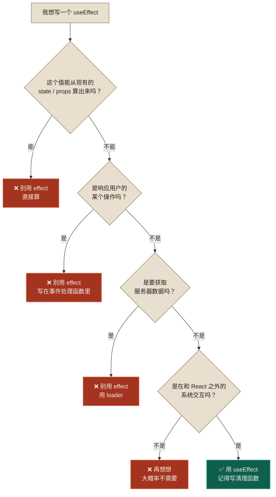

# 05 · React 速成教程（从原生 JS 到 React）

> 对应 [04 路线图](04-学习路线图.md) 的**阶段 1**。
> 本教程假设你会原生 JS/DOM，**每一节都用"原生 JS 写法 vs React 写法"对照**，帮你完成心智迁移。
> 全部代码可直接跑，环境：`npm create vite@latest my-app -- --template react-ts`

---

## 目录

- [第 0 章 · 心智模型（最重要）](#第-0-章--心智模型)
- [第 1 章 · JSX](#第-1-章--jsx)
- [第 2 章 · 组件与 Props](#第-2-章--组件与-props)
- [第 3 章 · State](#第-3-章--state)
- [第 4 章 · 事件与交互](#第-4-章--事件与交互)
- [第 5 章 · 条件与列表](#第-5-章--条件与列表)
- [第 6 章 · 表单](#第-6-章--表单)
- [第 7 章 · useEffect（重点：何时不用）](#第-7-章--useeffect)
- [第 8 章 · Context](#第-8-章--context)
- [第 9 章 · useRef 与自定义 Hook](#第-9-章--useref-与自定义-hook)
- [第 10 章 · 综合实战](#第-10-章--综合实战)

---

# 第 0 章 · 心智模型

**这一章不写代码，但它比后面九章加起来都重要。** 如果你带着原生 JS 的思维去写 React，会处处别扭。

## 0.1 根本区别：命令式 vs 声明式

假设需求：一个计数器，点按钮数字加一。

**原生 JS（命令式）——你告诉浏览器"怎么做"**

```js
const el = document.querySelector('#count');
const btn = document.querySelector('#btn');
let count = 0;

btn.addEventListener('click', () => {
  count++;                          // 1. 改数据
  el.textContent = count;           // 2. 手动同步 DOM  ← 关键区别在这
  if (count > 5) {
    el.classList.add('warning');    // 3. 手动同步样式
  } else {
    el.classList.remove('warning'); // 4. 别忘了反向操作！
  }
});
```

注意第 4 行——**你必须自己记得"反向操作"**。忘了写 `else` 分支，class 就永远去不掉了。这是原生 JS 最大的 bug 来源：**状态和 DOM 会不同步**。

**React（声明式）——你描述"是什么"**

```jsx
function Counter() {
  const [count, setCount] = useState(0);

  return (
    <button
      className={count > 5 ? 'warning' : ''}
      onClick={() => setCount(count + 1)}
    >
      {count}
    </button>
  );
}
```

**你只描述了"count 大于 5 时有 warning 类"这个事实**。至于从 5 变到 6 时要加 class、从 6 变回 5 时要去掉 class——React 自己算。

**核心公式**：

```
UI = f(state)
```

你写的组件是一个**函数**，输入是状态，输出是"界面应该长什么样"。你永远不需要写"从状态 A 变到状态 B 时该改哪些 DOM"。

## 0.2 组件函数会被反复调用

这是新手最难适应的一点。

```jsx
function Counter() {
  console.log('渲染了');           // ← 每次 count 变化，这行都会打印
  const [count, setCount] = useState(0);
  const now = new Date();          // ← 每次渲染都是新的
  return <button onClick={() => setCount(count + 1)}>{count}</button>;
}
```

点三次按钮，控制台打印四次"渲染了"（初次 + 三次更新）。

**推论 1**：组件函数体里不能放"只想执行一次"的代码。

```jsx
// ❌ 每次渲染都会重新发请求
function Bad() {
  fetch('/api/data');
  return <div/>;
}
```

**推论 2**：组件函数体里不能有副作用（改外部变量、改 DOM、发请求）。

**推论 3**：每次渲染的 `count` 都是那次渲染时的**快照**，是个常量。这解释了很多"闭包陷阱"：

```jsx
function Demo() {
  const [count, setCount] = useState(0);
  const handleClick = () => {
    setTimeout(() => {
      alert(count);      // ← 弹出的是"点击那一刻"的 count，不是最新的
    }, 3000);
  };
}
```

## 0.3 三个必须扔掉的旧习惯

| 旧习惯 | 为什么不行 | 新做法 |
|---|---|---|
| `document.querySelector` 找元素改它 | React 管着 DOM，你改了它下次渲染会覆盖掉 | 改 state |
| `el.classList.add/remove` | 同上 | `className={条件 ? 'a' : 'b'}` |
| `el.style.display = 'none'` | 同上 | `{条件 && <div/>}` 条件渲染 |
| `innerHTML = '...'` | XSS 风险 + 覆盖 React 的管理 | 返回 JSX |

**唯一例外**：需要和非 React 的第三方库集成时，用 `useRef` 拿到 DOM。这在 Shopify 里确实会遇到（操作 Polaris Web Components）。

## 0.4 心智检查

在往下读之前，确认你能回答：

1. 为什么 React 叫"声明式"？
2. 组件函数在一次点击后会执行几次？
3. 为什么组件函数里不能直接 `fetch`？

---

# 第 1 章 · JSX

## 1.1 它就是函数调用的语法糖

```jsx
const el = <h1 className="title">Hello</h1>;

// 编译后大致等价于：
const el = React.createElement('h1', { className: 'title' }, 'Hello');
```

理解这一点能解释很多规则。比如"为什么必须有单一根节点"——因为一个函数只能返回一个值。

## 1.2 与 HTML 的差异（必须记住）

```jsx
// ① class → className，for → htmlFor
<div className="card">
<label htmlFor="name">

// ② 事件用驼峰，值是函数不是字符串
<button onClick={handleClick}>        // ✅
<button onclick="handleClick()">      // ❌ HTML 写法

// ③ 所有标签必须闭合
<br />    <input />

// ④ style 是对象，属性名驼峰，数值自动加 px
<div style={{ marginTop: 8, backgroundColor: 'red' }} />
//         ↑ 外层是插值，内层是对象字面量

// ⑤ 注释
{/* 这是注释 */}

// ⑥ 单一根节点，多个用 Fragment
return (
  <>
    <h1>A</h1>
    <p>B</p>
  </>
);
```

## 1.3 插值 `{}` 只接受表达式

```jsx
const name = 'World';
const user = { first: 'Ada', last: 'L' };

<div>
  {name}                                  {/* ✅ 变量 */}
  {1 + 2}                                 {/* ✅ 运算 */}
  {user.first + ' ' + user.last}          {/* ✅ */}
  {list.map(x => <li key={x}>{x}</li>)}   {/* ✅ 函数调用 */}
  {cond ? 'A' : 'B'}                      {/* ✅ 三元 */}

  {if (cond) { ... }}                     {/* ❌ if 是语句不是表达式 */}
  {for (...) {}}                          {/* ❌ */}
</div>
```

**需要 if 逻辑怎么办**：在 return 之前写。

```jsx
function Status({ code }) {
  let text;
  if (code === 200) text = '成功';
  else if (code === 404) text = '未找到';
  else text = '错误';

  return <span>{text}</span>;
}
```

## 1.4 不会渲染的值

```jsx
{null}       {/* 不渲染 */}
{undefined}  {/* 不渲染 */}
{false}      {/* 不渲染 */}
{true}       {/* 不渲染 */}
{0}          {/* ⚠️ 会渲染出 "0"！ */}
{''}         {/* 不渲染 */}
```

**经典 bug**：

```jsx
{items.length && <List items={items} />}
// items 为空数组时，items.length 是 0 → 页面上出现一个孤零零的 "0"

// ✅ 正确
{items.length > 0 && <List items={items} />}
```

## 1.5 练习

把这段 HTML 转成 JSX：

```html
<div class="product-card">
  
  <label for="qty">数量</label>
  <input id="qty" type="number">
  <button onclick="addToCart()" style="margin-top: 8px; background: green">加入购物车</button>
</div>
```

<details>
<summary>答案</summary>

```jsx
<div className="product-card">
  
  <label htmlFor="qty">数量</label>
  <input id="qty" type="number" />
  <button onClick={addToCart} style={{ marginTop: 8, background: 'green' }}>
    加入购物车
  </button>
</div>
```
</details>

---

# 第 2 章 · 组件与 Props

## 2.1 从"函数返回 HTML 字符串"到"组件"

**原生 JS 里你可能这么复用**：

```js
function productCard(product) {
  return `
    <div class="card">
      <h3>${product.title}</h3>
      <span>${product.price}</span>
    </div>
  `;
}
container.innerHTML = products.map(productCard).join('');
```

**React 版本**：

```jsx
function ProductCard({ product }) {
  return (
    <div className="card">
      <h3>{product.title}</h3>
      <span>{product.price}</span>
    </div>
  );
}

// 使用
<ProductCard product={p} />
```

**关键差异**：React 版返回的不是字符串，是**描述 UI 的对象**。React 能对它做 diff，只更新变化的部分；字符串版每次都要整块重建 DOM。

## 2.2 Props 的完整用法

```jsx
// 定义（TS 版）
interface Props {
  title: string;
  price?: number;              // 可选
  onSelect: (id: string) => void;
  children?: React.ReactNode;
}

function Card({ title, price = 0, onSelect, children }: Props) {
  return (
    <div onClick={() => onSelect(title)}>
      <h3>{title}</h3>
      <span>{price}</span>
      {children}
    </div>
  );
}

// 使用
<Card title="Snowboard" price={100} onSelect={id => console.log(id)}>
  <p>这里是 children</p>
</Card>
```

**三条规则**：
1. **组件名必须大写开头**。`<card />` 会被当成 HTML 标签，`<Card />` 才是组件。
2. **props 是只读的**。`props.title = 'x'` 会报错。要改数据，让父组件改。
3. **props 可以传任何东西**：字符串、数字、对象、数组、函数、甚至 JSX。

## 2.3 children 与组合

`children` 是最重要的复用手段：

```jsx
function Panel({ title, children }) {
  return (
    <section className="panel">
      <h2>{title}</h2>
      <div className="body">{children}</div>
    </section>
  );
}

<Panel title="商品信息">
  <ProductCard product={p} />
  <Button>编辑</Button>
</Panel>
```

**进阶：把组件当 props 传**（这在 Polaris WC 里对应 `slot`）：

```jsx
function Layout({ header, sidebar, children }) {
  return (
    <div>
      <header>{header}</header>
      <aside>{sidebar}</aside>
      <main>{children}</main>
    </div>
  );
}

<Layout header={<Nav />} sidebar={<Filters />}>
  <ProductList />
</Layout>
```

对比 Shopify 里的写法：

```jsx
<s-page heading="Products">
  <s-button slot="primary-action">Save</s-button>   {/* 相当于 header prop */}
  <s-section slot="aside">侧栏</s-section>            {/* 相当于 sidebar prop */}
  <s-section>主内容</s-section>                       {/* 相当于 children */}
</s-page>
```

**同一个思想的两种实现**：React 用 props，Web Components 用 slot。

## 2.4 拆分组件的判断标准

新手常问"什么时候该拆成组件"。三条经验：

1. **有独立的状态** → 拆（比如一个可折叠面板）
2. **重复出现 ≥2 次** → 拆
3. **一个函数超过 80 行** → 拆

**不要为了拆而拆**。只用一次、没有状态、10 行的东西，留在原地更好读。

## 2.5 练习

把这个组件拆成 3 个：

```jsx
function ProductPage() {
  return (
    <div>
      <div className="header">
        <h1>商品列表</h1>
        <button>新建</button>
      </div>
      <div className="list">
        {products.map(p => (
          <div key={p.id} className="card">
            
            <h3>{p.title}</h3>
            <span>{p.price}</span>
          </div>
        ))}
      </div>
    </div>
  );
}
```

<details>
<summary>答案</summary>

```jsx
function PageHeader({ title, action }) {
  return (
    <div className="header">
      <h1>{title}</h1>
      {action}
    </div>
  );
}

function ProductCard({ product }) {
  return (
    <div className="card">
      
      <h3>{product.title}</h3>
      <span>{product.price}</span>
    </div>
  );
}

function ProductPage() {
  return (
    <div>
      <PageHeader title="商品列表" action={<button>新建</button>} />
      <div className="list">
        {products.map(p => <ProductCard key={p.id} product={p} />)}
      </div>
    </div>
  );
}
```
</details>

---

# 第 3 章 · State

## 3.1 为什么需要 state

```jsx
// ❌ 这样不行：普通变量改了不会重渲染
function Counter() {
  let count = 0;
  return <button onClick={() => { count++; console.log(count); }}>{count}</button>;
}
// 点击时 count 确实变了（控制台能看到），但界面永远显示 0
```

原因：组件重渲染时函数重新执行，`let count = 0` 又把它重置了；而且**改普通变量不会触发重渲染**。

```jsx
// ✅
function Counter() {
  const [count, setCount] = useState(0);
  return <button onClick={() => setCount(count + 1)}>{count}</button>;
}
```

`useState` 做了两件事：**跨渲染保存值** + **改值时触发重渲染**。

## 3.2 不可变更新（最容易错的地方）

React 用 `Object.is` 做**浅比较**判断状态是否变化。所以直接改原对象/数组，React 看到的还是同一个引用，认为"没变"，不重渲染。

### 数组

```jsx
const [list, setList] = useState(['a', 'b']);

// ❌ 全错
list.push('c');  setList(list);
list[0] = 'x';   setList(list);
list.splice(0,1); setList(list);
list.sort();     setList(list);       // sort 会原地修改！

// ✅ 增
setList([...list, 'c']);              // 末尾
setList(['c', ...list]);              // 开头
setList([...list.slice(0,1), 'x', ...list.slice(1)]);  // 中间插入

// ✅ 删
setList(list.filter(x => x !== 'a'));
setList(list.filter((_, i) => i !== index));

// ✅ 改
setList(list.map(x => x === 'a' ? 'A' : x));

// ✅ 排序（先复制）
setList([...list].sort());
```

### 对象

```jsx
const [user, setUser] = useState({ name: 'Ada', age: 30 });

// ❌
user.age = 31; setUser(user);

// ✅
setUser({ ...user, age: 31 });

// ✅ 嵌套对象要逐层展开
const [state, setState] = useState({ user: { profile: { name: 'A' } } });
setState({
  ...state,
  user: { ...state.user, profile: { ...state.user.profile, name: 'B' } }
});
```

嵌套太深说明**状态结构设计有问题**，考虑拍平。

### 对象数组（最常见）

```jsx
const [products, setProducts] = useState([
  { id: '1', title: 'A', qty: 1 },
  { id: '2', title: 'B', qty: 2 },
]);

// 修改某一项
setProducts(products.map(p =>
  p.id === '1' ? { ...p, qty: p.qty + 1 } : p
));
```

## 3.3 函数式更新

```jsx
// ❌ 只会 +1，不是 +2
setCount(count + 1);
setCount(count + 1);
// 因为这次渲染里 count 是固定的快照，两次都是 setCount(0 + 1)

// ✅ +2
setCount(c => c + 1);
setCount(c => c + 1);
```

**判断标准：新值依赖旧值时，用函数式。**

在异步回调里尤其重要：

```jsx
// ❌ 闭包捕获了旧的 count
setTimeout(() => setCount(count + 1), 1000);

// ✅
setTimeout(() => setCount(c => c + 1), 1000);
```

## 3.4 不要存派生状态

```jsx
// ❌ 两个 state 会不同步
const [items, setItems] = useState([]);
const [total, setTotal] = useState(0);
const [isEmpty, setIsEmpty] = useState(true);

function add(item) {
  setItems([...items, item]);
  setTotal(total + item.price);      // 忘了改就不同步了
  setIsEmpty(false);                  // 又一个要维护的
}

// ✅ 能算出来的就别存
const [items, setItems] = useState([]);
const total = items.reduce((s, i) => s + i.price, 0);
const isEmpty = items.length === 0;

function add(item) {
  setItems([...items, item]);         // 只维护一个真相来源
}
```

**法则：state 里只放"无法从其他 state/props 推导出来"的数据。**

这个原则在 Shopify 项目里更重要——见 [02 号文档 D3](02-React知识补充清单.md)。

## 3.5 state 放在哪一层

```jsx
// 两个兄弟组件要共享搜索关键词
function Page() {
  const [keyword, setKeyword] = useState('');   // ← 提升到共同父组件
  return (
    <>
      <SearchBar value={keyword} onChange={setKeyword} />
      <ProductList keyword={keyword} />
    </>
  );
}
```

**法则：state 放在"所有需要它的组件的最近共同祖先"。** 太高会导致无关组件重渲染，太低会共享不到。

## 3.6 练习

实现一个购物车：

```jsx
// 要求：
// - 商品列表，每项有 +/- 按钮和删除按钮
// - 显示总价和总件数
// - 数量减到 0 自动移除
// - 不许用第二个 useState 存总价
```

<details>
<summary>参考答案</summary>

```jsx
interface Item { id: string; title: string; price: number; qty: number }

function Cart() {
  const [items, setItems] = useState<Item[]>([
    { id: '1', title: 'Snowboard', price: 100, qty: 1 },
    { id: '2', title: 'Wax', price: 20, qty: 2 },
  ]);

  // 派生值，不用 state
  const total = items.reduce((s, i) => s + i.price * i.qty, 0);
  const count = items.reduce((s, i) => s + i.qty, 0);

  const changeQty = (id: string, delta: number) => {
    setItems(prev =>
      prev
        .map(i => (i.id === id ? { ...i, qty: i.qty + delta } : i))
        .filter(i => i.qty > 0)          // 数量为 0 自动移除
    );
  };

  const remove = (id: string) => setItems(prev => prev.filter(i => i.id !== id));

  if (items.length === 0) return <p>购物车是空的</p>;

  return (
    <div>
      {items.map(i => (
        <div key={i.id}>
          <span>{i.title}</span>
          <button onClick={() => changeQty(i.id, -1)}>-</button>
          <span>{i.qty}</span>
          <button onClick={() => changeQty(i.id, 1)}>+</button>
          <span>¥{i.price * i.qty}</span>
          <button onClick={() => remove(i.id)}>删除</button>
        </div>
      ))}
      <p>共 {count} 件，合计 ¥{total}</p>
    </div>
  );
}
```
</details>

---

# 第 4 章 · 事件与交互

## 4.1 基本写法

```jsx
// ✅ 传函数引用
<button onClick={handleClick}>

// ❌ 立即调用了！页面一渲染就执行
<button onClick={handleClick()}>

// ✅ 需要传参时用箭头函数包一层
<button onClick={() => remove(item.id)}>

// ✅ 事件对象
<form onSubmit={(e) => { e.preventDefault(); submit(); }}>
```

## 4.2 常用事件

```jsx
onClick  onDoubleClick  onMouseEnter  onMouseLeave
onChange  onInput  onFocus  onBlur
onSubmit  onKeyDown  onKeyUp
```

**注意**：React 的 `onChange` 行为像原生的 `oninput`——每次输入都触发，不是失焦才触发。

## 4.3 事件与状态联动

```jsx
function Toggle() {
  const [open, setOpen] = useState(false);
  return (
    <>
      <button onClick={() => setOpen(!open)}>
        {open ? '收起' : '展开'}
      </button>
      {open && <div>内容</div>}
    </>
  );
}
```

对比原生 JS 版本，注意 React 版**没有任何 DOM 操作**：

```js
// 原生 JS：要手动管两处 DOM
btn.addEventListener('click', () => {
  open = !open;
  content.style.display = open ? 'block' : 'none';
  btn.textContent = open ? '收起' : '展开';
});
```

## 4.4 阻止冒泡

```jsx
<div onClick={() => console.log('外层')}>
  <button onClick={(e) => { e.stopPropagation(); console.log('内层'); }}>
    点我
  </button>
</div>
```

---

# 第 5 章 · 条件与列表

## 5.1 条件渲染四式

```jsx
// ① && —— 有就显示，没有就不显示（最常用）
{error && <p className="error">{error}</p>}

// ② 三元 —— 二选一
{isLoading ? <Spinner /> : <Content />}

// ③ 提前 return —— 整个组件的分支
function List({ items }) {
  if (!items) return <Spinner />;
  if (items.length === 0) return <Empty />;
  return <ul>{items.map(...)}</ul>;
}

// ④ 变量赋值 —— 多分支
let content;
if (a) content = <A />;
else if (b) content = <B />;
else content = <C />;
return <div>{content}</div>;
```

**推荐顺序**：能用③（提前 return）就用③，最好读。

## 5.2 列表渲染与 key

```jsx
{products.map(p => (
  <ProductCard key={p.id} product={p} />
))}
```

### key 为什么重要

React 通过 key 判断"这一次渲染里的某个元素，是不是上一次的那个元素"。

**用 index 当 key 的经典 bug**：

```jsx
// 列表：['A', 'B', 'C']，每项有个输入框
{items.map((item, i) => <input key={i} defaultValue={item} />)}

// 在头部插入 'X' → ['X', 'A', 'B', 'C']
// React 看到 key=0 还是 key=0，认为是同一个元素，只更新内容
// 结果：输入框里用户输入的内容错位了
```

**规则**：
- 有稳定唯一 id → 用 id
- 没有 → 想办法造一个（`crypto.randomUUID()` 在创建时生成并存下来）
- **只有在列表永不排序、永不增删时**，才可以用 index

**Shopify 场景**：GID 天然唯一，直接用。

```jsx
{products.map(p => <Row key={p.id} product={p} />)}
// p.id 形如 "gid://shopify/Product/108828309"
```

### key 的位置

```jsx
// ❌ key 在里层
{items.map(i => <div><Item key={i.id} /></div>)}

// ✅ key 在 map 直接返回的那层
{items.map(i => <div key={i.id}><Item /></div>)}

// ✅ 需要 Fragment 时用完整写法
{items.map(i => (
  <React.Fragment key={i.id}>
    <dt>{i.term}</dt>
    <dd>{i.desc}</dd>
  </React.Fragment>
))}
```

## 5.3 完整的列表页模式（Shopify 里天天写）

```jsx
function ProductList({ products, isLoading, error }) {
  if (isLoading) return <Spinner />;
  if (error) return <ErrorBanner message={error} />;
  if (products.length === 0) return <EmptyState />;

  return (
    <ul>
      {products.map(p => <ProductCard key={p.id} product={p} />)}
    </ul>
  );
}
```

**四种状态：加载中 / 出错 / 空 / 有数据。** 新手最常漏"空"状态。Shopify App 审核会看这个。

---

# 第 6 章 · 表单

> **注意**：这一章掌握基础即可。Shopify App 的表单主要走 React Router 的 `<Form>`/`action`（见 [07 号文档](07-ReactRouter7数据流教程.md)），不需要受控组件。

## 6.1 受控组件

```jsx
function SearchBox() {
  const [value, setValue] = useState('');
  return (
    <input
      value={value}
      onChange={e => setValue(e.target.value)}
    />
  );
}
```

**"受控"的含义**：输入框显示什么完全由 state 决定，用户输入只是"请求改 state"。

```
用户敲键盘 → onChange → setValue → 重渲染 → value 变化 → 输入框更新
```

如果你只写 `value={value}` 不写 `onChange`，输入框会**打不出字**（React 会警告）。

## 6.2 各类表单元素

```jsx
// 文本
<input value={text} onChange={e => setText(e.target.value)} />

// 数字（注意 e.target.value 永远是字符串）
<input type="number" value={n} onChange={e => setN(Number(e.target.value))} />

// 勾选框用 checked
<input type="checkbox" checked={agree} onChange={e => setAgree(e.target.checked)} />

// 下拉
<select value={status} onChange={e => setStatus(e.target.value)}>
  <option value="draft">草稿</option>
  <option value="active">上架</option>
</select>

// 多行
<textarea value={desc} onChange={e => setDesc(e.target.value)} />
```

## 6.3 多字段表单：用一个对象

```jsx
function ProductForm() {
  const [form, setForm] = useState({ title: '', price: 0, status: 'draft' });

  const update = (field: string) => (e) =>
    setForm(prev => ({ ...prev, [field]: e.target.value }));
    //                              ↑ 计算属性名

  return (
    <form onSubmit={e => { e.preventDefault(); save(form); }}>
      <input value={form.title} onChange={update('title')} />
      <input value={form.price} onChange={update('price')} />
      <button type="submit">保存</button>
    </form>
  );
}
```

## 6.4 非受控组件（其实更接近 Shopify 的做法）

```jsx
function Form() {
  const handleSubmit = (e) => {
    e.preventDefault();
    const data = new FormData(e.currentTarget);
    console.log(data.get('title'));      // 直接从 DOM 读
  };
  return (
    <form onSubmit={handleSubmit}>
      <input name="title" defaultValue="" />
      <button>提交</button>
    </form>
  );
}
```

**这个模式很重要**——React Router 的 `<Form>` + `action` 本质就是它的增强版。Shopify App 里你会大量用到 `FormData`。

---

# 第 7 章 · useEffect

> ⚠️ **本章最重要的内容不是"怎么用"，而是"什么时候不用"。**

## 7.1 基本语法

```jsx
useEffect(() => {
  // 副作用代码（在渲染提交到 DOM 之后执行）
  return () => {
    // 清理函数
  };
}, [依赖项]);
```

## 7.2 依赖数组三种形态

```jsx
useEffect(() => {...});            // 每次渲染后都执行
useEffect(() => {...}, []);        // 只在挂载后执行一次
useEffect(() => {...}, [a, b]);    // a 或 b 变化时执行
```

## 7.3 清理函数

```jsx
useEffect(() => {
  const timer = setInterval(() => console.log('tick'), 1000);
  return () => clearInterval(timer);      // ← 不写会内存泄漏
}, []);

useEffect(() => {
  const onResize = () => setWidth(window.innerWidth);
  window.addEventListener('resize', onResize);
  return () => window.removeEventListener('resize', onResize);
}, []);
```

**清理函数的执行时机**：
1. 组件卸载时
2. **依赖变化导致 effect 重新执行前**（先清理旧的，再跑新的）

## 7.4 React 18 严格模式的"执行两次"

开发环境下，`<React.StrictMode>` 会故意让每个 effect **执行 → 清理 → 再执行**。

**这不是 bug，是特性**——用来暴露"没写清理函数"的问题。生产环境只执行一次。

如果你的 effect 执行两次导致问题（比如重复发请求、重复添加数据），说明**清理函数没写对**。

## 7.5 ⚠️ 什么时候不该用 useEffect（本章核心）

### 反例 1：用 effect 算派生值

```jsx
// ❌
const [items, setItems] = useState([]);
const [total, setTotal] = useState(0);
useEffect(() => {
  setTotal(items.reduce((s, i) => s + i.price, 0));
}, [items]);
// 问题：多一次渲染，还可能不同步

// ✅ 直接算
const total = items.reduce((s, i) => s + i.price, 0);
```

### 反例 2：用 effect 响应用户事件

```jsx
// ❌
const [submitted, setSubmitted] = useState(false);
useEffect(() => {
  if (submitted) { sendRequest(); setSubmitted(false); }
}, [submitted]);

// ✅ 事件里直接做
const handleSubmit = () => sendRequest();
```

### 反例 3：用 effect 拉数据（Shopify 里尤其错）

```jsx
// ❌ 通用 React 教程的写法
const [products, setProducts] = useState([]);
useEffect(() => {
  fetch('/api/products').then(r => r.json()).then(setProducts);
}, []);
// 问题：① 瀑布流请求 ② 竞态条件 ③ 在 Shopify 里根本调不了 Admin API（secret 在服务端）

// ✅ Shopify 的写法
export const loader = async ({ request }) => {
  const { admin } = await authenticate.admin(request);
  const res = await admin.graphql(`{ products(first: 10) { nodes { id title } } }`);
  return (await res.json()).data;
};

export default function Page() {
  const data = useLoaderData<typeof loader>();   // 直接就有数据
}
```

### 反例 4：用 effect 同步 props 到 state

```jsx
// ❌
function Form({ initialTitle }) {
  const [title, setTitle] = useState('');
  useEffect(() => setTitle(initialTitle), [initialTitle]);
}

// ✅ 用 key 让组件重新挂载
<Form key={product.id} initialTitle={product.title} />
```

## 7.6 useEffect 的正当用途：与外部系统同步

**判断标准：这个副作用是不是在和"React 管辖之外的东西"打交道？**

正当场景：
- 订阅浏览器事件（resize、scroll、keydown）
- 操作 DOM API（focus、滚动位置、canvas）
- 定时器
- 集成第三方库（图表、地图、编辑器）
- **调用非 React 的宿主 API**

最后一条就是 Shopify 官方模板里唯一的 useEffect：

```jsx
const shopify = useAppBridge();
const productId = fetcher.data?.product?.id;

useEffect(() => {
  if (productId) {
    shopify.toast.show("Product created");
  }
}, [productId, shopify]);
```

**为什么这里必须用 effect**：`shopify.toast` 是 App Bridge 提供的、跑在 iframe 外层的系统，不受 React 管辖。当服务端返回了新数据（productId 出现），需要"通知外部系统"。这是教科书级的正当用法。

## 7.7 决策流程图



<details>
<summary>纯文本版（无 Mermaid 渲染环境展开）</summary>

```
我想写一个 useEffect
    ↓
这个值能从现有 state/props 算出来吗？
    ├─ 能 → ❌ 别用 effect，直接算
    └─ 不能
         ↓
    是响应用户的某个操作吗？
         ├─ 是 → ❌ 别用 effect，写在事件处理函数里
         └─ 不是
              ↓
         是要获取服务器数据吗？
              ├─ 是 → ❌ 别用 effect，用 loader
              └─ 不是
                   ↓
              是在和 React 之外的系统交互吗？
                   ├─ 是 → ✅ 用 useEffect，记得写清理
                   └─ 不是 → 再想想，大概率不需要
```

</details>

---

# 第 8 章 · Context

## 8.1 解决什么问题

```jsx
// ❌ props 逐层钻透（prop drilling）
<App theme={theme}>
  <Layout theme={theme}>
    <Sidebar theme={theme}>
      <Menu theme={theme}>
        <MenuItem theme={theme} />   // 只有这里真正用到
```

## 8.2 用法三步

```jsx
// ① 创建
const ThemeContext = createContext<'light' | 'dark'>('light');

// ② 提供
function App() {
  const [theme, setTheme] = useState<'light'|'dark'>('light');
  return (
    <ThemeContext.Provider value={theme}>
      <Layout />
    </ThemeContext.Provider>
  );
}

// ③ 消费（任意深度）
function MenuItem() {
  const theme = useContext(ThemeContext);
  return <li className={theme}>...</li>;
}
```

## 8.3 常见封装：Context + 自定义 Hook

```jsx
const ShopContext = createContext(null);

export function ShopProvider({ children, value }) {
  return <ShopContext.Provider value={value}>{children}</ShopContext.Provider>;
}

export function useShop() {
  const ctx = useContext(ShopContext);
  if (!ctx) throw new Error('useShop 必须在 ShopProvider 内使用');
  return ctx;
}
```

**Shopify 里你天天在用这个模式**：

```jsx
// 模板的 app/routes/app.tsx
<AppProvider embedded apiKey={apiKey}>
  <Outlet />
</AppProvider>

// 任意子组件里
const shopify = useAppBridge();     // ← 就是包了 useContext 的自定义 Hook
shopify.toast.show("Saved");
```

## 8.4 注意事项

- Context 值变化时，**所有消费它的组件都会重渲染**。别把频繁变化的东西放进去。
- 不要用 Context 代替 props。只有真正跨多层的才用。
- **不要用 Context 当全局状态管理器**——在 Shopify 全栈里，服务器数据在 loader，URL 状态在 search params，你需要 Context 的场景很少。

---

# 第 9 章 · useRef 与自定义 Hook

## 9.1 useRef 的两个用途

### 用途一：拿 DOM 元素

```jsx
function SearchBox() {
  const inputRef = useRef<HTMLInputElement>(null);

  useEffect(() => {
    inputRef.current?.focus();      // 挂载后自动聚焦
  }, []);

  return <input ref={inputRef} />;
}
```

### 用途二：存不触发重渲染的可变值

```jsx
function Timer() {
  const [count, setCount] = useState(0);
  const timerRef = useRef<number | null>(null);

  const start = () => {
    timerRef.current = window.setInterval(() => setCount(c => c + 1), 1000);
  };
  const stop = () => {
    if (timerRef.current) clearInterval(timerRef.current);
  };
}
```

**ref vs state**：

| | useState | useRef |
|---|---|---|
| 改变时重渲染 | ✅ | ❌ |
| 跨渲染保存 | ✅ | ✅ |
| 渲染中读取 | ✅ | ⚠️ 不应该 |
| 用途 | 影响 UI 的数据 | DOM 引用、定时器 id、不影响 UI 的值 |

### ⚠️ Shopify 里 ref 的关键用途

给 Polaris Web Components 传复杂数据（React 18 无法通过 attribute 传对象）：

```jsx
function ProductSelect({ options }) {
  const ref = useRef<HTMLElement>(null);

  useEffect(() => {
    if (ref.current) {
      (ref.current as any).options = options;   // 直接赋 property
    }
  }, [options]);

  return <s-select ref={ref} label="商品" />;
}
```

详见 [02 号文档 D1](02-React知识补充清单.md)。

## 9.2 自定义 Hook

**规则**：函数名必须 `use` 开头，内部可以调用其他 Hook。

```jsx
// 例 1：防抖
function useDebounce<T>(value: T, delay = 300): T {
  const [debounced, setDebounced] = useState(value);
  useEffect(() => {
    const t = setTimeout(() => setDebounced(value), delay);
    return () => clearTimeout(t);
  }, [value, delay]);
  return debounced;
}

// 用法
const [keyword, setKeyword] = useState('');
const debouncedKeyword = useDebounce(keyword, 500);
```

```jsx
// 例 2：开关
function useToggle(initial = false) {
  const [on, setOn] = useState(initial);
  const toggle = useCallback(() => setOn(v => !v), []);
  return [on, toggle, setOn] as const;
}

// 用法
const [isOpen, toggleOpen] = useToggle();
```

```jsx
// 例 3：localStorage 持久化
function useLocalStorage<T>(key: string, initial: T) {
  const [value, setValue] = useState<T>(() => {
    const raw = localStorage.getItem(key);
    return raw ? JSON.parse(raw) : initial;
  });

  useEffect(() => {
    localStorage.setItem(key, JSON.stringify(value));
  }, [key, value]);

  return [value, setValue] as const;
}
```

## 9.3 Hooks 铁律

```jsx
// ❌ 不能在条件里
if (cond) { const [a] = useState(); }

// ❌ 不能在循环里
for (...) { useState(); }

// ❌ 不能在嵌套函数里
function handler() { useState(); }

// ✅ 只能在组件/自定义 Hook 的顶层
function Comp() {
  const [a] = useState();
  const [b] = useState();
  if (cond) { ... }        // 条件写在 Hook 之后
}
```

**原因**：React 靠"第几次调用 useState"来对应存的哪个值。顺序一变，值就错位了。

装 `eslint-plugin-react-hooks` 会自动帮你检查（Shopify 模板里已经配好了，版本 `^7.0.1`）。

---

# 第 10 章 · 综合实战

把前九章串起来。这个练习的结构**刻意模仿 Shopify App 的商品管理页**，做完之后进入阶段 2 会很顺。

## 需求

```
商品管理页
├── 顶部：标题 + "新建商品"按钮
├── 筛选栏：搜索框（防抖）+ 状态下拉（全部/草稿/上架）
├── 列表：商品卡片（图片、标题、价格、状态标签）
│   └── 每项：编辑按钮、删除按钮
├── 状态处理：加载中 / 空列表 / 无搜索结果
└── 底部：显示"共 N 个商品，总价值 ¥X"
```

## 约束（重要）

1. 只用 `useState` / `useEffect` / `useRef`，**不许装任何库**
2. 总价和数量必须是**派生值**，不许用 state
3. 至少抽出 **2 个自定义 Hook**
4. 全程 TypeScript，`tsc --noEmit` 零报错
5. 每个 `useEffect` 写注释说明"为什么不能不用它"

## 骨架

```tsx
// types.ts
export interface Product {
  id: string;
  title: string;
  price: number;
  image: string;
  status: 'draft' | 'active';
}

// hooks/useDebounce.ts
export function useDebounce<T>(value: T, delay = 300): T { /* 见 9.2 */ }

// hooks/useProducts.ts
export function useProducts() {
  const [products, setProducts] = useState<Product[]>(MOCK);
  const remove = (id: string) => setProducts(p => p.filter(x => x.id !== id));
  const update = (id: string, patch: Partial<Product>) =>
    setProducts(p => p.map(x => (x.id === id ? { ...x, ...patch } : x)));
  return { products, remove, update };
}

// App.tsx
function App() {
  const { products, remove, update } = useProducts();
  const [keyword, setKeyword] = useState('');
  const [status, setStatus] = useState<'all' | 'draft' | 'active'>('all');
  const debouncedKeyword = useDebounce(keyword);

  // 派生值 —— 不用 state
  const filtered = products.filter(p =>
    (status === 'all' || p.status === status) &&
    p.title.toLowerCase().includes(debouncedKeyword.toLowerCase())
  );
  const total = filtered.reduce((s, p) => s + p.price, 0);

  return (
    <div>
      <PageHeader title="商品" action={<button>新建商品</button>} />
      <FilterBar
        keyword={keyword} onKeywordChange={setKeyword}
        status={status} onStatusChange={setStatus}
      />
      <ProductList
        products={filtered}
        isEmpty={products.length === 0}
        onRemove={remove}
        onUpdate={update}
      />
      <footer>共 {filtered.length} 个商品，总价值 ¥{total}</footer>
    </div>
  );
}
```

## 自检清单

做完之后逐条检查：

```
□ 组件数量 ≥ 8 个
□ 没有一个 state 是能从别的 state 算出来的
□ 所有列表都有稳定的 key，没用 index
□ "加载中/空/无结果/有数据" 四种状态都处理了
□ 至少 2 个自定义 Hook
□ tsc --noEmit 通过，没有 any
□ 每个 useEffect 都能解释"为什么不能不用"
□ 没有一处 document.querySelector 或 classList 操作
□ 用 React DevTools 看过组件树和重渲染
```

---

# 学习资源

## 首选（中文）
- **[React 官方中文文档](https://zh-hans.react.dev/learn)** ⭐⭐⭐
  这是目前最好的 React 教材，没有之一。重点读这几篇：
  - [描述 UI](https://zh-hans.react.dev/learn/describing-the-ui)
  - [添加交互](https://zh-hans.react.dev/learn/adding-interactivity)
  - [状态管理](https://zh-hans.react.dev/learn/managing-state)
  - **[你可能不需要 Effect](https://zh-hans.react.dev/learn/you-might-not-need-an-effect)** ← 本教程第 7 章的深化版，必读
  - [使用 Ref 引用值](https://zh-hans.react.dev/learn/referencing-values-with-refs)

## 辅助
- [React TypeScript 速查表](https://react-typescript-cheatsheet.netlify.app/)（英文，查 props 类型怎么写）
- [React DevTools 使用指南](https://zh-hans.react.dev/learn/react-developer-tools)

## ⚠️ 避坑
- **不要看 2022 年之前的教程**——大量 class 组件内容，已过时
- **不要看讲 Redux/Next.js 的综合课**——你现在不需要
- **不要看讲 `@shopify/polaris` React 组件的 Shopify 教程**——已废弃

---

**下一步**：完成阶段 1 产出物后，去 [06 · TypeScript 与 GraphQL 教程](06-TypeScript与GraphQL教程.md)。
