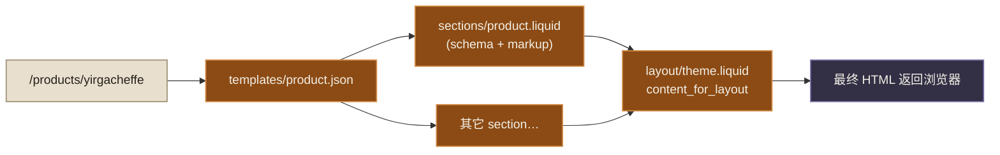
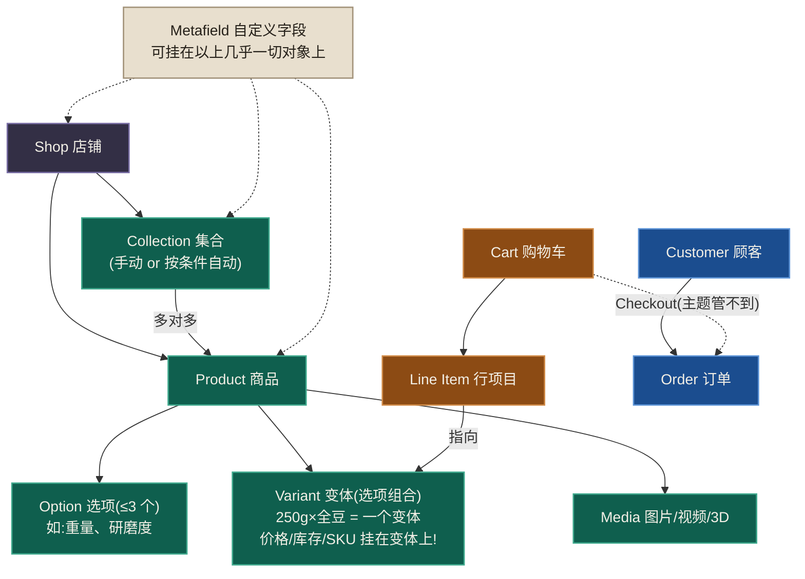

# 03 · 主题架构与渲染流程

> **先说结论**:一个主题 = **展示层(`.liquid` 文件)+ 数据层(`.json` 文件)**。一次页面请求的流程永远是:`URL → 路由到模板(templates/*.json)→ 模板列出若干 section → 每个 section 渲染自己 → 结果塞进 layout/theme.liquid 的 content_for_layout`。把这条链路刻进脑子,任何"这块内容是哪来的"都能顺藤摸瓜。

---

## 1. 八个目录各管什么(对照你的 `my-new-theme/`)

| 目录 | 职责 | 你仓库里的实例 |
|---|---|---|
| `layout/` | 页面外壳(html/head/body) | `theme.liquid`(所有页)、`password.liquid`(密码墙页) |
| `templates/` | **每种页面类型一个模板**,JSON 格式,列出该页由哪些 section 组成 | `index.json`、`product.json`、`cart.json`… |
| `sections/` | 页面级积木,带 ``,商家可在编辑器里配置 | `header.liquid`、`product.liquid`、`custom-section.liquid`… |
| `blocks/` | **第三代新增**:主题级可复用块,能被任意 section 使用、能嵌套 | `text.liquid`、`group.liquid` |
| `snippets/` | 代码复用单元,`` 调用,无 schema | `image.liquid`、`css-variables.liquid`、`meta-tags.liquid` |
| `assets/` | 静态资源(css/js/图标),`asset_url` 引用,**没有子目录** | `critical.css`、`icon-cart.svg` |
| `config/` | `settings_schema.json`(全局设置的定义)+ `settings_data.json`(商家填的值) | 同名 |
| `locales/` | 翻译文件 | `en.default.json`(店面文案)、`en.default.schema.json`(编辑器文案) |

两条对比,防止看老项目时懵:

- **Dawn(第二代)没有 `blocks/` 目录**,块都定义在各 section 的 schema 里,不能跨 section 复用。
- 老教程里的 `templates/*.liquid`(第一代)已经只剩 `gift_card.liquid` 这种特殊页在用。

---

## 2. URL → 模板:路由是平台定死的

Shopify 的 URL 结构不可自定义(这是平台,不是你的 Express),对应关系背下来:

| URL | 模板 | 上下文对象 |
|---|---|---|
| `/` | `index.json` | — |
| `/products/<handle>` | `product.json` | `product` |
| `/collections/<handle>` | `collection.json` | `collection` |
| `/collections` | `list-collections.json` | — |
| `/cart` | `cart.json` | `cart`(其实是全局) |
| `/pages/<handle>` | `page.json` | `page` |
| `/blogs/<blog>/<article>` | `article.json` | `article` |
| `/blogs/<blog>` | `blog.json` | `blog` |
| `/search` | `search.json` | `search` |
| 未匹配 | `404.json` | — |
| `/account` 系列 | `customers/*.json` | `customer` 等 |

**handle** 是 Shopify 给每个资源(商品/集合/页面/博客)分配的 URL 唯一标识(小写连字符,如 `ethiopia-yirgacheffe`),后台可改,全平台(Liquid、GraphQL、Ajax)通用。

**模板变体**:复制一份命名为 `product.coffee.json`,商家就能在后台给某些商品单独指定这个模板——同类页面不同布局的标准解法,不用写 if。

---

## 3. 解剖 `layout/theme.liquid`

打开你的 `my-new-theme/layout/theme.liquid`,骨架一定是:

```liquid
<!doctype html>
<html lang="{{ request.locale.iso_code }}">
  <head>
    ...
                     
    {{ content_for_header }}                 
                 
  </head>
  <body>
                
    <main>
      {{ content_for_layout }}               
    </main>
    
  </body>
</html>
```

三个记忆点:

1. `{{ content_for_header }}` 少了主题直接报错,**别动它、别包它**;App 注入的脚本(以及性能问题)大多从这来。
2. `{{ content_for_layout }}` 就是"路由命中的模板渲染完的 HTML"。
3. 头尾不写死在 layout 里,而是引用 **section group**。

## 4. Section Group:头尾也积木化

`sections/header-group.json`:

```json
{
  "type": "header",
  "name": "Header group",
  "sections": {
    "header": { "type": "header", "settings": {} }
  },
  "order": ["header"]
}
```

它是一个"容器 JSON",商家可以往头部组里加公告栏 section、往底部组里加订阅 section,而**不需要你改 layout 代码**。``(注意复数)渲染整个组;老代码里 ``(单数)是写死单个 section 的旧写法,还能用,但商家没法在组里增删。

---

## 5. JSON 模板:数据而非代码

`templates/product.json` 长这样:

```json
{
  "sections": {
    "main": {
      "type": "product",
      "settings": {}
    }
  },
  "order": ["main"]
}
```

- `"type": "product"` → 渲染 `sections/product.liquid`;
- `sections` 是字典(key 是实例 id),`order` 决定顺序;
- 商家在编辑器里给商品页加的每个 section、改的每项设置,都会写进这个文件——**JSON 模板是商家数据,`.liquid` 才是你的代码**(第 01 章练习 3 你已亲眼见过)。

于是完整渲染链路:



---

## 6. 领域模型总图(本系列最重要的一张图)

主题、App、Hydrogen 三条线操作的都是同一套商业对象。Theme 线的价值就是让你在真实界面里把它摸熟:



三条铁律,现在建立,受益整个 Shopify 生涯:

1. **价格、库存、SKU 属于 Variant,不属于 Product。** 没有选项的商品也有一个隐藏的默认变体。加购物车加的永远是 variant id。
2. **Collection 与 Product 多对多**,集合可以按规则自动收商品(如 tag 含 "ethiopia")。
3. **Checkout 与 Order 主题碰不到**,主题的边界到 `/cart` 为止。

---

## 7. 全局对象速览(任何文件可用)

| 对象 | 内容 | 高频用法 |
|---|---|---|
| `shop` | 店铺信息 | `shop.name`、`shop.currency` |
| `settings` | 商家在主题设置里填的所有值 | `settings.logo` |
| `cart` | 当前访客的购物车 | `cart.item_count`、`cart.total_price` |
| `customer` | 已登录顾客,未登录为 nil | `` |
| `request` | 当前请求 | `request.page_type`、`request.design_mode`(是否在编辑器里预览) |
| `routes` | 所有系统 URL | `routes.cart_url`、`routes.root_url` |
| `localization` | 当前语言/国家及可选项 | 第 08 章 |
| `collections` / `pages` / `blogs` | 按 handle 取任意资源 | `collections['coffee'].products` |
| `linklists` | 后台配置的导航菜单 | `linklists.main-menu.links` |

**URL 永远用 `routes`,不要硬编码** `/cart`——多语言店铺的 URL 带 `/zh-CN/` 前缀,硬编码直接 404(此坑上线才爆,极隐蔽)。

---

## 🛠 练习

1. 口述(或画出)访问 `/collections/all` 时,从 URL 到 HTML 的完整链路,精确到文件名。
2. 新建模板变体:复制 `templates/page.json` 为 `templates/page.about.json`,往里加一个 `custom-section`;在后台新建一个 Page 并指定该模板,验证效果。
3. 在 `theme.liquid` 里找到 `content_for_header` 和 `content_for_layout`,删掉后者保存,看看报什么错(看完改回来)。
4. 用 `theme console` 验证领域模型:取一个商品,输出 `product.options`、`product.variants.size`、`product.variants.first.inventory_quantity`,对照第 6 节的图理解。

## ✅ 自测

- 商家说"商品页想换个布局,但只有咖啡豆类商品用新布局",标准解法是什么?(答不出看第 2 节末尾)
- `templates/product.json` 和 `sections/product.liquid` 谁是代码谁是数据?商家的编辑器操作改哪个?
- 为什么价格挂在 variant 上而不是 product 上?一个无选项商品有几个变体?
- 硬编码 `/cart` 什么场景下会炸?

## 🔁 带去 App 线

- 第 6 节领域模型图**原封不动**就是 Admin GraphQL 的 schema 骨架:`shop`、`product.variants`、`collection.products`、`order.lineItems` 全部同名。App 线学 GraphQL 时你只是在换查询语法,不是学新模型。
- `request.design_mode` 这种"运行环境探测"思想,对应 App 线的 embedded/standalone 环境判断。
