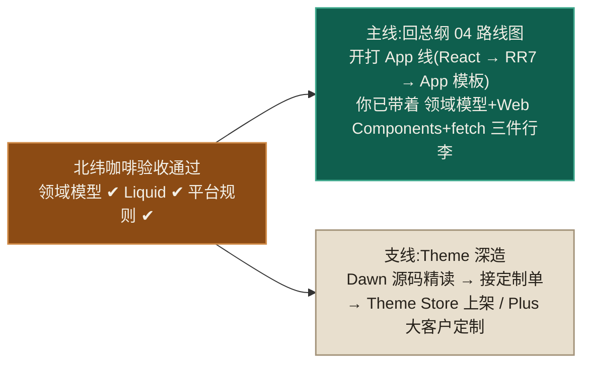

# 10 · 部署协作与实战项目

> **先说结论**:主题没有构建流水线,"部署"就是 `push`,难的从来不是发布,而是**双主体写入问题**——你在 git 里改代码文件,商家同时在编辑器里改 JSON 数据文件(`templates/*.json`、`settings_data.json`)。谁覆盖谁,是主题协作事故的唯一来源。本章给出纪律,然后对两周成果做验收。

---

## 1. 店铺里的主题位模型

| 状态 | 说明 |
|---|---|
| Live theme | 顾客看到的那一个 |
| Unpublished | 主题库存位(共 20 个),做改版/备份 |
| Development theme | `theme dev` 创建,不占 20 位,顾客不可见 |

## 2. 手动流:CLI 部署三板斧

```bash
# 场景一:交付新主题 —— 推成未发布主题,商家预览满意后再发布
shopify theme push --unpublished --theme "北纬咖啡 v1.0"
shopify theme publish --theme <ID>          # 或商家在后台点 Publish

# 场景二:迭代已有主题 —— 先收编辑器改动,再推代码
shopify theme pull --theme <ID>             # 把商家改的 JSON 拉回来 → git 提交
shopify theme push --theme <ID>

# 场景三:只推代码、绝不碰商家数据(增量修 bug 最稳)
shopify theme push --theme <ID> --ignore "templates/*.json" --ignore "config/settings_data.json"

# 给客户看:临时预览主题 + 分享链接
shopify theme share
```

**铁律:push 之前必先 pull。** 直接 push 会把商家昨天在编辑器里调的首页横幅顶掉,这是新手把客户改没的经典事故(第 01 章埋的伏笔,这里正式立法)。

## 3. 标准流:GitHub 集成(团队/长期项目用)

店铺后台 → Themes → Add theme → **Connect from GitHub**,把**分支**连成主题:

- 分支 push → 自动同步到对应主题;
- 商家在编辑器里的改动 → **自动 commit 回分支**(作者是 Shopify GitHub App);
- 于是"双主体写入"被 git 收编:冲突显式化,可 review、可回滚。

推荐布局:

| 分支 | 连接的主题 | 用途 |
|---|---|---|
| `main` | Live theme | 只进已验证代码 |
| `staging` | Unpublished 主题 | 客户验收 |
| 功能分支 | 各自 dev theme(CLI) | 日常开发 |

配套纪律:**代码文件(liquid/css/js/schema)只由 git 流入;数据文件(JSON)以编辑器为准**——rebase 功能分支时数据文件冲突一律取 remote(编辑器侧);上线合并前 `git diff` 过一眼 `settings_data.json`,确认没把商家配置回滚。

## 4. 上线 Checklist(逐项打勾再发布)

**功能边缘**:404 页、空购物车、空搜索结果、无图商品、超长标题、售罄品、密码页。
**交易**:开发店用测试网关下一单测试订单,走完 加购→结账→(后台)退款 全流程。
**多端**:iOS Safari + Android Chrome 真机各过一遍(仅 DevTools 模拟不算数)。
**质量门**:`shopify theme check` 零 error;第 09 章 Lighthouse 达标线;键盘全流程可用。
**内容**:favicon、社交分享卡、翻译无缺(切语言巡一遍)、旧站迁移时后台配好 URL 重定向。
**兜底**:发布前把当前 Live 主题 Duplicate 一份留档,随时可一键回滚。

> Theme Store 上架(卖模板)另有一套严格审核(设计、性能硬线、功能完备度),门槛远高于接单交付,路线见官方 Theme Store requirements——两周阶段知道存在即可。

---

## 5. 两周实战验收:北纬咖啡

前面各章练习若都做了,你手里已经是一个完整店铺主题。对照验收:

### 功能矩阵

| 模块 | 要求 | 出自 |
|---|---|---|
| 首页 | 图文横排 + 精选集合(product-card 复用)+ 卖点列表 + FAQ(theme blocks 嵌套) | 04/05 |
| 商品页 | 选项级变体切换(价格/库存/URL 联动)、媒体画廊、规格表(metafields)、产区卡(metaobject)、相关推荐 | 05/06/07 |
| 集合页 | 分页 + 排序 + 筛选(价格区间+选项) | 05 |
| 购物车 | Ajax 加购 + 抽屉(改量/删行/角标同步)+ 422 兜底 + 零 JS 也能买 | 06 |
| 品牌层 | 设置驱动的颜色/字体/圆角,编辑器换色全站联动 | 08 |
| 多语言 | 中英双语,切换器,无硬编码文案 | 08 |
| 质量 | Lighthouse 达标线、theme check 零 error、键盘全流程、JSON-LD 通过验证 | 09 |
| 交付 | staging 主题 + share 链接 + 一单测试订单截图 | 10 |

### 硬性验收标准(做不到不算完成)

1. 在主题编辑器里,**不碰任何代码**,把首页 section 重排、换配色、改文案,全部生效——证明 schema 合同完整;
2. 禁用 JS 后仍能完成购买——证明渐进增强底座没塌;
3. 换一个新的开发店重新 push 这套主题,配置从零可搭——证明没把数据写死在代码里。

### 收尾动作

- 全部代码进 git,打 tag `v1.0`;
- 给 `my-new-theme` 写一份 200 字内的 README 交付说明(装什么 App、metafield 定义清单、设置项说明)——**metafield 定义不随主题走**,这份文档就是迁移手册。

---

## 6. 毕业去向



按总纲的判断:**主线是 App**。Theme 线到此的目的已达成——你现在对 product/variant/collection/cart/metafield 的理解是"摸过、写过、被坑过"级别的,这正是 App 线最贵的入场券。

## ✅ 自测

- "push 前必 pull"防的是什么事故?GitHub 集成后这个问题变成了什么形态?
- `--ignore "templates/*.json"` 的使用场景?
- 为什么交付文档里必须包含 metafield 定义清单?
- 上线前 Duplicate 一份 Live 主题是在防什么?

## 🔁 带去 App 线

- "代码归 git、数据归平台"的双主体模型,App 线同样存在(App 配置 vs 商家数据),纪律通用。
- `shopify theme push/pull` 的心智直接平移到 `shopify app deploy`;分支↔环境的映射习惯也一致。
- 你写交付文档的习惯,就是 App 上架时写 App Store listing 与审核材料的习惯。
