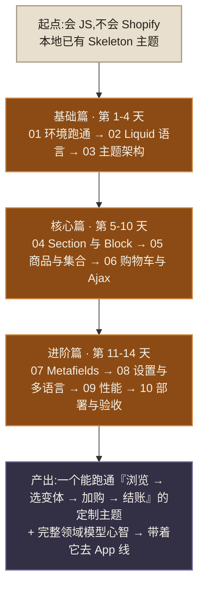

# Theme 主题开发完全教程 · 总览

> 本系列是总纲里 [08 · 三条线实战入门](../08-三条线实战入门.md) 第三部分(Theme 速览)的**完整展开版**。
> 定位:用 **两周主线**(每天 2-4 小时)从零到能独立交付一个主题定制,同时把 Shopify 领域模型(product / variant / collection / cart / metafield)吃透——这是你之后打 App 线的地基。
> 实战载体:你本地的 `my-new-theme/`(官方 **Skeleton Theme**,theme blocks 新架构),参考主题:Dawn(存量市场最大)与 Horizon(官方最新旗舰)。
> 前置要求:会原生 JS / ES6,会基本 HTML/CSS。**不需要 React,不需要构建工具。**

---

## 0. 先看四条结论

### 结论一:2025 年起主题架构换代了,别学旧教程

主题开发经历了三代:

| 代际 | 关键词 | 现状 |
|---|---|---|
| 第一代(vintage) | `.liquid` 模板写死一切 | 已淘汰 |
| 第二代(Online Store 2.0,2021) | JSON 模板 + Sections Everywhere | 存量最大(Dawn) |
| 第三代(theme blocks,2024 底-2025) | `blocks/` 目录、可嵌套可复用的块 | **新项目标准**(Skeleton / Horizon) |

网上 90% 的中文教程停在第一、二代。你的 `my-new-theme` 是第三代 Skeleton,**本系列直接按第三代教,同时讲清第二代**(因为接单改的老店大多是 Dawn 系)。

### 结论二:Theme 线的技术栈小得惊人

`Liquid(模板语言)+ 原生 CSS + 原生 JS(Web Components 风格)`,没了。没有 npm 依赖、没有构建步骤、没有框架。你唯一要新学的语言是 Liquid,**两天够用,一周熟练**。难的从来不是语法,是领域模型和平台规则——这正是本系列的重点。

### 结论三:主题改不了结账页(checkout)

主题只管**店面(storefront)**:首页、商品页、集合页、购物车页。点"Checkout"之后的结账流程是 Shopify 托管的,主题碰不到——定制结账属于 App 线(Checkout UI Extensions,Plus 商家专属)。接单时用户说"改结账页"要立刻识别出这不是主题活。

### 结论四:所有交互 = 原生 JS + 平台自带的 HTTP 接口

主题里的动态功能(加购、迷你购物车、预测搜索、变体切换)全靠三样:**Cart Ajax API**(几个 JSON 端点)、**Section Rendering API**(让服务端重渲一小块 HTML 返给你)、原生 `fetch`。这对"会 JS 不会 React"的你是主场作战。

---

## 1. 章节索引

标 ⭐ 的是核心章,时间紧可以只精读它们。

| # | 章节 | 一句话内容 | 建议天数 |
|---|---|---|---|
| 01 | [环境与第一次跑通](01-环境与第一次跑通.md) | Partner 账号、开发店、CLI、`theme dev` 热重载、主题编辑器 | 第 1 天 |
| 02 ⭐ | [Liquid 语言完全教程](02-Liquid语言完全教程.md) | 输出、标签、过滤器、对象与作用域、render、坑 | 第 2-3 天 |
| 03 ⭐ | [主题架构与渲染流程](03-主题架构与渲染流程.md) | 8 个目录、JSON 模板、一次请求如何变成页面、领域模型总图 | 第 3-4 天 |
| 04 ⭐ | [Section 与 Block 开发](04-Section与Block开发.md) | schema 全解、setting 类型、theme blocks、从零写可配置组件 | 第 5-6 天 |
| 05 ⭐ | [商品与集合](05-商品与集合.md) | product/variant/option 模型、商品页表单、集合分页筛选排序 | 第 7-8 天 |
| 06 ⭐ | [购物车与 Ajax API](06-购物车与AjaxAPI.md) | cart 模型、Ajax 加购、Section Rendering、手写购物车抽屉 | 第 9-10 天 |
| 07 | [Metafields 与 Metaobjects](07-Metafields与Metaobjects.md) | 自定义数据建模、动态资源、自定义内容页 | 第 11 天 |
| 08 | [主题设置与多语言](08-主题设置与多语言.md) | settings_schema、CSS 变量注入、locales、翻译过滤器 | 第 12 天 |
| 09 | [性能、SEO 与可访问性](09-性能SEO与可访问性.md) | 响应式图片、CWV、结构化数据、a11y、Theme Check | 第 13 天 |
| 10 | [部署协作与实战项目](10-部署协作与实战项目.md) | push/pull、GitHub 集成、上线清单、**两周实战验收** | 第 14 天 |
| 99 | [速查表](99-速查表.md) | Liquid 对象/过滤器/标签、CLI 命令、Ajax 端点 | 随时查 |

**贯穿实战**:从第 4 章起,所有练习围绕同一个虚构项目——手冲咖啡豆品牌店「北纬咖啡」(有变体:250g/1kg × 全豆/研磨;有集合:按产区;有自定义数据:风味描述/海拔)。第 10 章对它做验收。

---

## 2. 每章的固定结构

- **先说结论**:本章你要建立的心智模型,一段话。
- **正文**:讲解 + 可直接粘进 `my-new-theme` 跑的代码。
- **🛠 练习**:动手任务,产出可见效果。
- **✅ 自测**:答不上来就没学会,回去重读。
- **🔁 带去 App 线**:本章哪些概念在 App/GraphQL 里原样复用(如 Liquid 的 `product.variants` ↔ Admin GraphQL 的 `product.variants` connection)。这是本系列与你主线目标的接口。

---

## 3. 用什么练

| 用途 | 选择 | 说明 |
|---|---|---|
| 写代码 | `my-new-theme/`(Skeleton) | 极简、无历史包袱、第三代架构,**主战场** |
| 抄作业 | [Shopify/dawn](https://github.com/Shopify/dawn) | 第二代集大成者,变体选择器/购物车抽屉的参考实现 |
| 看新范式 | [Shopify/horizon](https://github.com/Shopify/horizon) | 官方最新旗舰,theme blocks 全面落地 |
| 查文档 | [shopify.dev/docs/storefronts/themes](https://shopify.dev/docs/storefronts/themes) 与 [shopify.dev/docs/api/liquid](https://shopify.dev/docs/api/liquid) | 唯一权威,遇到分歧以它为准 |

另外:`my-new-theme/` 里官方自带了 `CLAUDE.md` / `AGENTS.md`,在该目录下用 Claude Code 干活时它会自动遵守主题最佳实践——让 AI 替你写模板时质量更稳。

---

## 4. 版本与时效性声明

- 本系列写作日期 **2026-08-03**,基于官方文档、Skeleton / Dawn / Horizon 仓库源码知识编写,与总纲(核实日期 2026-07-27)同代。
- Shopify 主题体系当前处于"第三代(theme blocks)推广期",`sections/` 与 `blocks/` 并存是常态,不是你理解错了。
- 命令行为、schema 字段若与官方文档冲突,**以官方文档为准**,并欢迎回来修订本系列。
